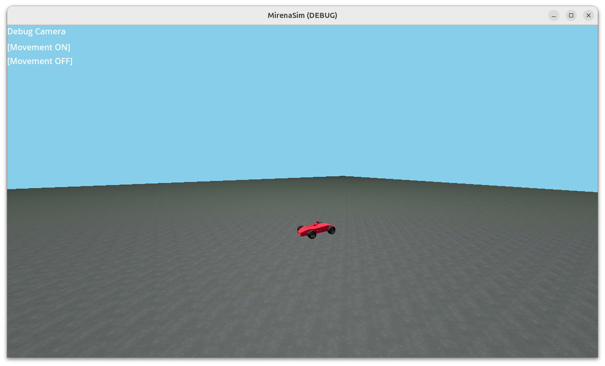
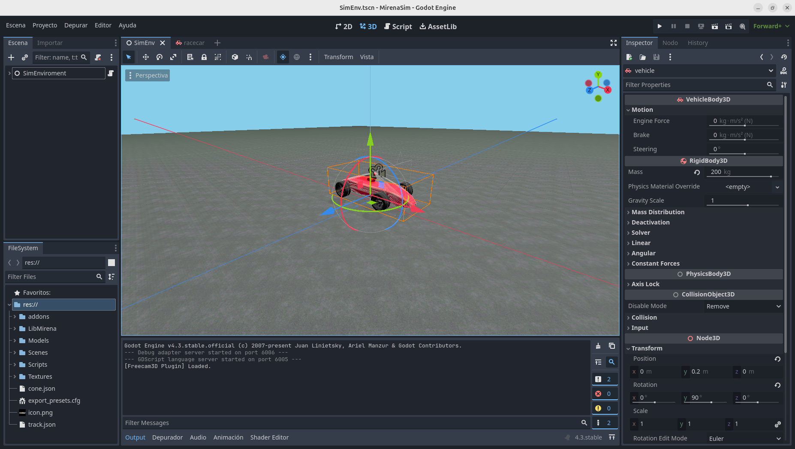

# MirenaSim
MirenaSim es el simulador desarrollado In-Haus para desarrollar y testear el sistema autónomo
por completo, para ello implementa todos los sensores que uno esperaría tener en un vehículo
real.

## Instalación
MirenaSim es un paquete más de ROS2, viene incluido por defecto [mirena_ws](https://github.com/Tecnun-eRacing/mirena_ws),
el entorno de trabajo del proyecto. Puede obtenerse por separado en [mirena_sim](https://github.com/Tecnun-eRacing/mirena_sim/)
para su uso y compilación es necesario tener instalado godot en el $PATH (Hay que pushear godot a rosdep), una vez descargado ejecutamos:
```bash
git submodule init
git submodule update
colcon --build --packages-select mirena_sim
```
## Current Features
- Sensores
    - IMU
    - LIDAR
    - GPS
    - Cámara
- Carga de Pistas en formato MirenaTrack
- Tiempo simulado
- Generación de Datasets para reconocimiento de Conos

## Overview
MirenaSim es simplemente una integración del motor de videojuegos godot
en el entorno de robótica ROS2, por medio de la interfáz de extensión GDEXTENSION
que proporciona godot. 

La ventaja de usar Godot radica en la precisión de la simulación comparado a la vida
real, comparado con Sistemas como Gazebo, Godot permite una mayor extensibilidad y 
customización para nuestro caso de uso.

## Uso 
Para arrancar el simulador desde el entorno de trabajo hay que tener previamente
sourceado ros2 y el entorno de trabajo.
```bash
source install/setup.sh
ros2 launch mirena_sim mirena_sim_launch.py
```
Esto debería arrancar una ventana con el entorno de simulación


## Controles
|**Tecla**|**Función**|
|---------|-----------|
|**TAB**|Toggle Freecam|
|**m**|Carga del mapa|
|**l**|Cambio entre control manual y ROS|
|**p**|Dump YOLOV8 para la carpeta configurada|

## Customización y modificación
Si sourceas el entorno y ejecutas godot podrás editar el proyecto de Godot 
localizado en la carpeta MirenaSim del paquete allí puedes cambiar cosas
como el posiciónamiento de los sensores o el comportamiento del vehículo.
