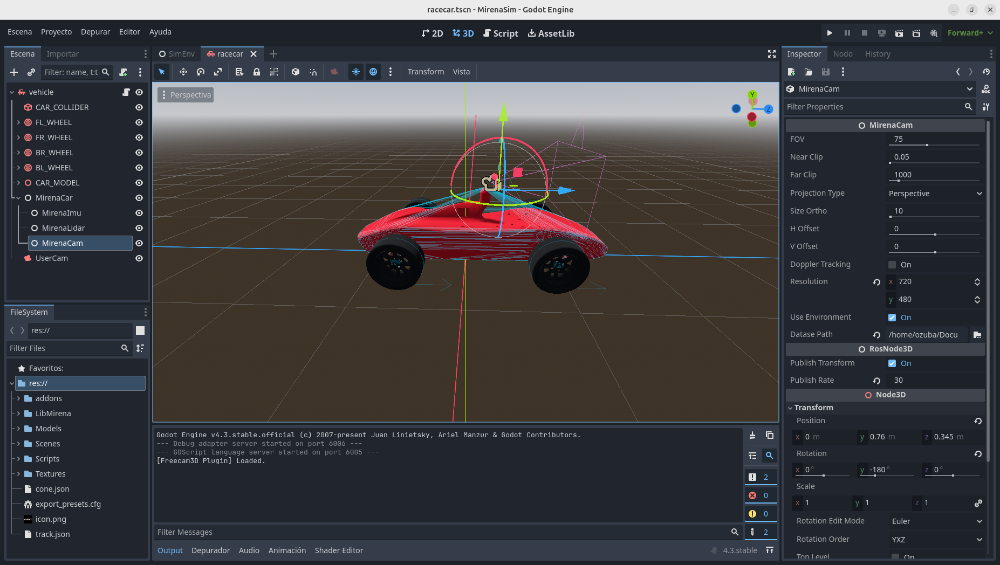
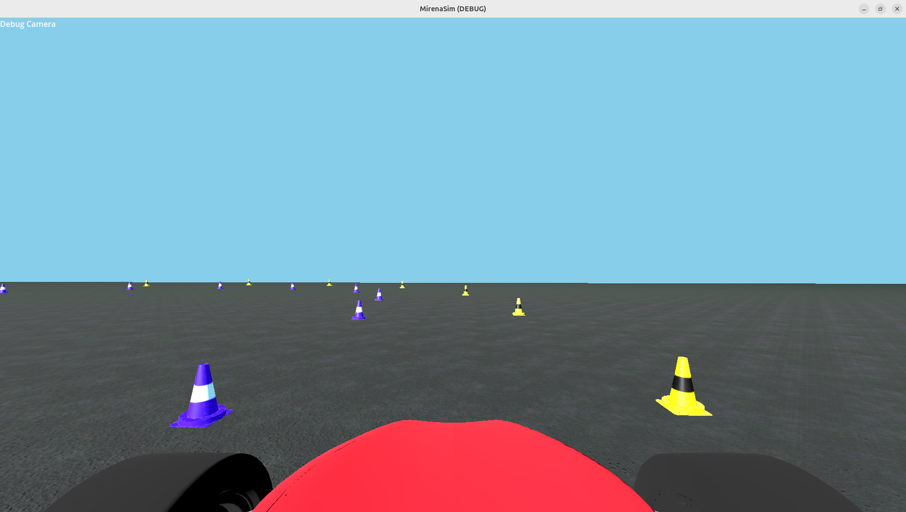

# Tutorial: Training YOLOV8 para reconocer Conos de un feed de video
Para Implementar el pipeline de percepción es necesario el uso 
de una red neuronal que localice y clasifique los obstaculos que el 
coche enfrenta por pantalla, creemos que es algo clave en el desarrollo del
proyecto dado que las cámaras son sensores baratos, rápidos y que aportan
muchisima información semantica de la situación de la pista.

## Prerequisitos
Un entorno con:

- ROS2 Instalado
- mirena_ws instalado
- un entorno virtual python con ultralytics
- Un sistema acelerado por gráfica como google colab/DIPC  para entrenar


### Generación del dataset
Necesitaremos Generar 2 conjuntos de datos:
- Un set de entrenamiento
- Un set de validación

Para elegir donde generá el simulador cada set de datos entraremos al editor
y cambiaremos la opción Dataset Path del objeto MirenaCam correspondiente.


Podemos elegirlo solo una vez y despues separar manualmente las imagenes que
queramos para los distintos sets, si queremos podemos darle al play para 
arrancar el simulador o compilarlo con colcon y lanzarlo
a través de `ros2 launch`


### Generar Datos
Cargamos una pista con la tecla m (Hay una pista por defecto en el folder MirenaSim)
Conducimos el vehículo por medio de un mando, deteniendolo para tomar 
capturas de cada frame (Para evitar un bug de desync entre fisicas y frame que desencuadra el dataset)


### Exportar datos y entrenar la red
Una vez hayamos obtenido la cantidad deseada de datos en distintas posiciones
separamos nuestros 2 sets antes mencionados y nos disponemos a entrenar la red.

Necesitaremos añadir un fichero data.yml para coordinar el entrenamiento
la documentación de yolo indica como debe estar estructurado, adjunto el 
siguiente ejemplo:

```yaml
# Paths
train: ./train  # Path to training images
val: ./val      # Path to validation images

# Dataset
names:
  0: blue
  1: yellow

# Model
model: yolov8n.pt  # Pre-trained model checkpoint to start training (e.g., yolov8n, yolov8s, yolov8m)

# Training Parameters
epochs: 50               # Number of epochs
batch: 16                # Batch size
workers: 8               # Number of data-loading threads
project: runs/train      # Save results to runs/train
name: yolov8_custom      # Name of the experiment
device: 0                # Device to train on (e.g., 0 for GPU, 'cpu' for CPU, or '0,1' for multi-GPU)

# Optimization
optimizer: SGD           # Optimizer: SGD, Adam, or AdamW
lr0: 0.01                # Initial learning rate
momentum: 0.937          # Momentum for SGD
weight_decay: 0.0005     # Weight decay
warmup_epochs: 3.0       # Warmup epochs
warmup_momentum: 0.8     # Warmup momentum
warmup_bias_lr: 0.1      # Warmup initial bias learning rate

# Augmentations
hsv_h: 0.015             # Image hue augmentation (fraction)
hsv_s: 0.7               # Image saturation augmentation (fraction)
hsv_v: 0.4               # Image value augmentation (fraction)
degrees: 0.0             # Image rotation (+/- degrees)
translate: 0.1           # Image translation (+/- fraction)
scale: 0.5               # Image scale (+/- gain)
shear: 0.0               # Image shear (+/- degrees)
perspective: 0.0         # Image perspective (+/- fraction), range 0-0.001
flipud: 0.0              # Vertical flip (probability)
fliplr: 0.5              # Horizontal flip (probability)
mosaic: 1.0              # Mosaic augmentation (probability)
mixup: 0.0               # Mixup augmentation (probability)

# Logging and Saving
save: True               # Save the model after every epoch
exist_ok: False          # Overwrite existing project folder if it exists
```

Nos tiene que quedar la siguente configuración de ficheros

```bash
├── data.yml
├── train
│   ├── images
│   └── labels
└── val
    ├── images
    └── labels
```

Adjunto el siguiente Dataset de Ejemplo para facilitar el familizarizarse
con el proceso de training:

[MirenaCones](assets/MirenaCones.zip) (200 Img Train/25 Img Val) 


# Proceso de entrenamiento
En este caso trabajaremos con notebooks de python en cualquier entorno
con aceleración hardware para acelerar el proceso. Cargaremos nuestro dataset generado en dicho entorno y los bloques a ejecutar
serán los siguientes. 

```python
!pip install ultralytics #Instala el paquete ultralytics
```

```python
!nvidia-smi # Comprueba si tenemos aceleración grafica nvidia
```
```python
!yolo train model=yolov8n.pt data=/content/datasets/MirenaCones/data.yml epochs=50 # Inicia el proceso de entrenamiento
```
Terminado el entrenamiento sacamos los mejores pesos y 
los guardamos a buen recaudo.

## Test de inferencia
Podeis probar a ejecutar inferencia contra una imagen de prueba cualquiera mediante:
```python
!yolo predict model=best.pt source="miImagen.png"
```

## Inferencia en tiempo real
Dejo el siguiente script para que probeis inferencia en tiempo real 
contra el topic de ROS2 de la camara.

```python
import rclpy
from rclpy.node import Node
from sensor_msgs.msg import Image
from cv_bridge import CvBridge
import cv2
from ultralytics import YOLO
import numpy as np

class YoloV8ObjectDetectionNode(Node):
    def __init__(self):
        super().__init__('yolov8_object_detection_node')

        # Parameters
        self.declare_parameter('video_topic', '/MirenaCam/image')
        self.declare_parameter('yolo_model_path', 'conesNN.pt')

        self.video_topic = self.get_parameter('video_topic').value
        self.yolo_model_path = self.get_parameter('yolo_model_path').value

        # Load YOLOv8 model
        self.model = YOLO(self.yolo_model_path)
        self.bridge = CvBridge()

        # Subscriber
        self.subscription = self.create_subscription(
            Image,
            self.video_topic,
            self.image_callback,
            10
        )

        self.get_logger().info(f"Subscribed to topic: {self.video_topic}")
        self.get_logger().info(f"Loaded YOLO model: {self.yolo_model_path}")

    def image_callback(self, msg):
        try:
            # Convert ROS Image message to OpenCV image
            frame = self.bridge.imgmsg_to_cv2(msg, desired_encoding='bgr8')

            # Perform object detection
            results = self.model(frame)

            annotated_frame = results[0].plot()

            # Display the annotated frame
            cv2.imshow('YOLOv8 Object Detection', annotated_frame)
            cv2.waitKey(1)

        except Exception as e:
            self.get_logger().error(f"Error processing image: {e}")


def main(args=None):
    rclpy.init(args=args)
    node = YoloV8ObjectDetectionNode()
    try:
        rclpy.spin(node)
    except KeyboardInterrupt:
        node.get_logger().info('Shutting down YOLOv8 Object Detection Node')
    finally:
        cv2.destroyAllWindows()
        node.destroy_node()
        rclpy.shutdown()

if __name__ == '__main__':
    main()
```
Si lo ejecutais podreis ver la clasificación en tiempo real de los conos
y validar si vuestro modelo funciona a gusto.
<video width="640"  controls>
    <source src="../assets/demo.mp4" type="video/mp4">
</video>


## Anexo
Script para visualizar los dataset
```python
import os
import cv2

def load_yolo_annotations(annotation_path, width, height):
    """Load YOLO annotations and convert them to bounding box coordinates."""
    annotations = []
    with open(annotation_path, 'r') as f:
        for annotation in f.readlines():
            parts = annotation.strip().split()
            class_id = int(parts[0])
            x_center = float(parts[1])
            y_center = float(parts[2])
            w = float(parts[3])
            h = float(parts[4])

            # Convert to pixel values
            x_center = int(x_center * width)
            y_center = int(y_center * height)
            w = int(w * width)
            h = int(h * height)

            # Calculate bounding box corners
            x1 = x_center - w // 2
            y1 = y_center - h // 2
            x2 = x_center + w // 2
            y2 = y_center + h // 2

            annotations.append((class_id, x1, y1, x2, y2))
    return annotations

def visualize_yolo_annotations(image_path, annotation_path, class_names=None):
    """ Visualizes images with YOLO annotations with navigation support. """
    # Load the image using OpenCV
    image = cv2.imread(image_path)
    height, width, _ = image.shape

    # Read the annotations for the image
    annotations = load_yolo_annotations(annotation_path, width, height)

    # Draw bounding boxes
    for class_id, x1, y1, x2, y2 in annotations:
        # Draw bounding box (green)
        cv2.rectangle(image, (x1, y1), (x2, y2), (0, 255, 0), 2)

        # Optionally, draw the class label
        if class_names:
            label = class_names[class_id] if class_id < len(class_names) else str(class_id)
            cv2.putText(image, label, (x1, y1 - 10), cv2.FONT_HERSHEY_SIMPLEX, 0.9, (0, 255, 0), 2)

    # Show the image with annotations
    cv2.imshow('YOLOv8 Annotations', image)

def navigate_images(img_folder, label_folder, class_names=None):
    """ Function to navigate through images and their annotations using left and right arrows. """
    img_files = sorted(os.listdir(img_folder))  # Sort images
    label_files = sorted(os.listdir(label_folder))  # Sort corresponding label files
    index = 0  # Start from the first image

    # Create a window for image display
    cv2.namedWindow('YOLOv8 Annotations', cv2.WINDOW_NORMAL)

    while True:
        # Get the paths of the current image and annotation
        img_path = os.path.join(img_folder, img_files[index])
        label_path = os.path.join(label_folder, label_files[index])

        # Visualize the new image and annotations
        visualize_yolo_annotations(img_path, label_path, class_names)

        # Wait for key press and handle navigation
        key = cv2.waitKey(0) & 0xFF  # Get key press event

        if key == ord('q'):  # Press 'q' to quit
            break
        elif key == 81:  # Left arrow key (ASCII code 81)
            index -= 1
        elif key == 83:  # Right arrow key (ASCII code 83)
            index += 1

        # Make sure the index stays within valid range
        index = max(0, min(index, len(img_files) - 1))

        # Clear the previous image and annotations (not needed anymore as OpenCV updates the same window)
        # cv2.destroyAllWindows()  # Not needed in this case

    cv2.destroyAllWindows()  # Close the window when done

# Example usage:
img_folder = '/home/ozuba/Documentos/MirenaCones/train/images'
label_folder = '/home/ozuba/Documentos/MirenaCones/train/labels'
class_names = ['blue', 'yellow']  # Replace with your actual class names

# Start navigation through images
navigate_images(img_folder, label_folder, class_names)
```